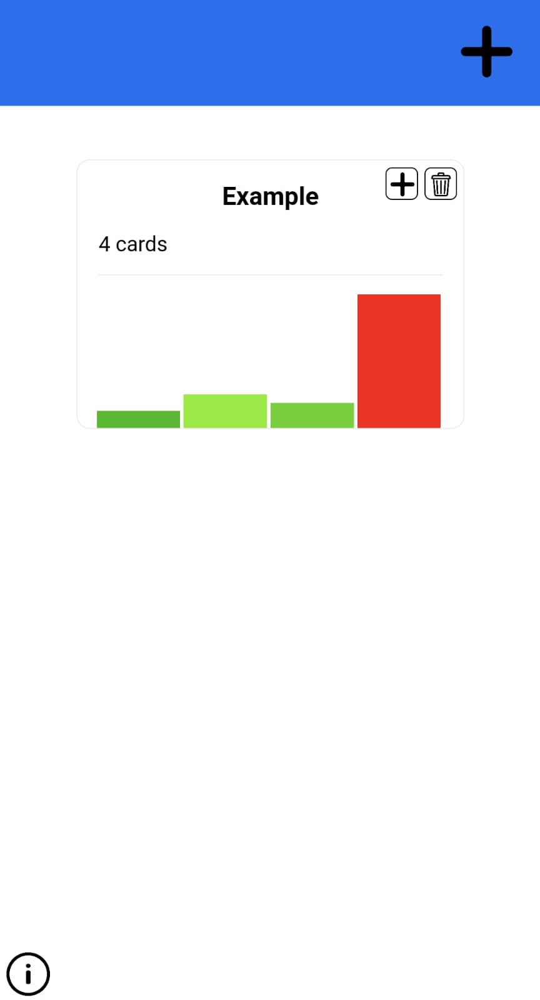
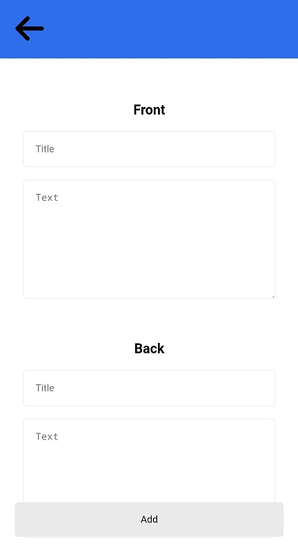
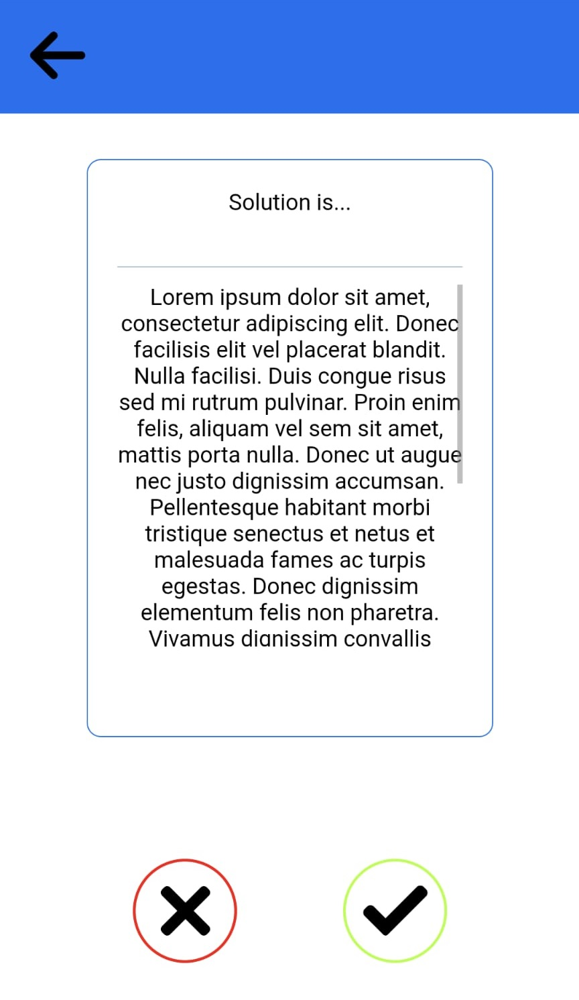
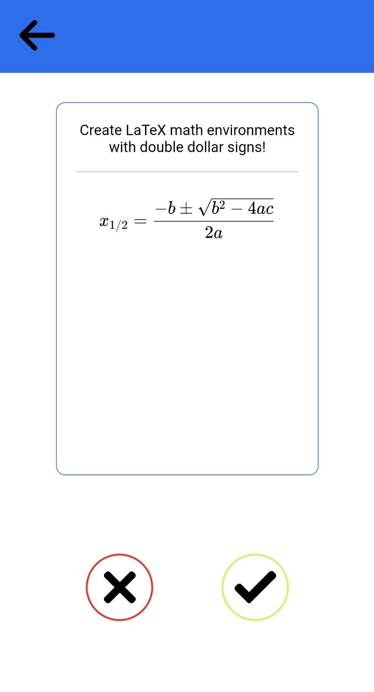

<div id="top"></div>
<!--
*** Thanks for checking out the Best-README-Template. If you have a suggestion
*** that would make this better, please fork the repo and create a pull request
*** or simply open an issue with the tag "enhancement".
*** Don't forget to give the project a star!
*** Thanks again! Now go create something AMAZING! :D
-->


<!-- PROJECT SHIELDS -->
<!--
*** I'm using markdown "reference style" links for readability.
*** Reference links are enclosed in brackets [ ] instead of parentheses ( ).
*** See the bottom of this document for the declaration of the reference variables
*** for contributors-url, forks-url, etc. This is an optional, concise syntax you may use.
*** https://www.markdownguide.org/basic-syntax/#reference-style-links
-->
[![Contributors][contributors-shield]][contributors-url]
[![Forks][forks-shield]][forks-url]
[![Stargazers][stars-shield]][stars-url]
[![MIT License][license-shield]][license-url]


<!-- PROJECT LOGO -->
<br />
<div align="center">

<h3 align="center">Flash/Cards</h3>

  <p align="center">
    A simple flashcard based study app.
    <br />
    <br />
    <a href="https://github.com/TheCodingDamian/flashcards/issues">Report Bug</a>
    ·
    <a href="https://github.com/TheCodingDamian/flashcards/issues">Request Feature</a>
  </p>
</div>


<!-- TABLE OF CONTENTS -->
<details>
  <summary>Table of Contents</summary>
  <ol>
    <li>
      <a href="#about-the-project">About The Project</a>
      <ul>
        <li><a href="#built-with">Built With</a></li>
      </ul>
    </li>
    <li>
      <a href="#getting-started">Getting Started</a>
      <ul>
        <li><a href="#prerequisites">Prerequisites</a></li>
        <li><a href="#installation">Installation</a></li>
      </ul>
    </li>
    <li><a href="#usage">Usage</a></li>
    <li><a href="#roadmap">Roadmap</a></li>
    <li><a href="#license">License</a></li>
    <li><a href="#acknowledgments">Acknowledgments</a></li>
  </ol>
</details>


<!-- ABOUT THE PROJECT -->
## About The Project

This is a study app that allows you to create flashcards and use them for (self-supervised) study. Flashcards can be designed with short title texts and longer content texts, and allow the use of LaTeX formulas for mathematical questions.

<p align="right">(<a href="#top">back to top</a>)</p>


### Built With

* [Next.js](https://nextjs.org/)
* [React.js](https://reactjs.org/)

<p align="right">(<a href="#top">back to top</a>)</p>


<!-- GETTING STARTED -->
## Getting Started

To get a local copy up and running follow these simple example steps.

### Prerequisites

This project requires the existence of `npm` to run the server on your device. Make sure you install the latest version using
* npm
  ```sh
  npm install npm@latest -g
  ```

### Installation

1. Clone the repository
   ```sh
   git clone https://github.com/TheCodingDamian/flashcards.git
   ```
2. Install NPM packages
   ```sh
   npm install
   ```

3. Run the dev server using
    ```sh
    npm run dev
    ```
    or build and run the project using
    ```sh
    npm run deploy
    ```

4. Access the app through your browser on `http://localhost:3000`.

<p align="right">(<a href="#top">back to top</a>)</p>


<!-- USAGE EXAMPLES -->
## Usage


After running the server, you can access this app through your browser on `http://localhost:3000`.

<div style="text-align: center">

</div>

An example deck of flashcards has already been created, showing some of the app's basic features.
You can open and view the deck by clicking it in the deck selection view.

Alternatively, you can create a new study deck using the 'plus' icon in the top right. This will prompt you to select a new name for the deck (which has to be different from all other existing decks).

Once you created a deck, you can add cards to it by clicking the 'plus' icon next to the deck in the deck selection view. This will open a new screen, allowing you to enter all necessary data for the creation of the card.

<div style="text-align:center">



</div>

Finally, you can study a deck by clicking it in the deck selection. This will start a new study session, containing the 20 cards with the highest difficulty score (difficulty scores are computed by the rate at which you choose the "yes" or "no" buttons while studying a card). 


You can turn a card to check its backside by clicking on it. Pressing the "checkmark" or "cross" buttons allows you to indicate whether you were able to recall the necessary information.


<p align="right">(<a href="#top">back to top</a>)</p>


<!-- ROADMAP -->
## Roadmap

- [x] API Routes
- [x] Basic User Interface
- [ ] Future UI Updates
    - [ ] Responsive design
    - [ ] Swipe cards for feedback
- [ ] Even more awesomeness!

<p align="right">(<a href="#top">back to top</a>)</p>


<!-- LICENSE -->
## License

Distributed under the MIT License. See `LICENSE.txt` for more information.

<p align="right">(<a href="#top">back to top</a>)</p>


<!-- ACKNOWLEDGMENTS -->
## Acknowledgments

* Thank you to [Best-README-Template](https://github.com/othneildrew/Best-README-Template) for the README template

<p align="right">(<a href="#top">back to top</a>)</p>


<!-- MARKDOWN LINKS & IMAGES -->
<!-- https://www.markdownguide.org/basic-syntax/#reference-style-links -->
[contributors-shield]: https://img.shields.io/github/contributors/TheCodingDamian/flashcards.svg?style=for-the-badge
[contributors-url]: https://github.com/TheCodingDamian/flashcards/graphs/contributors
[forks-shield]: https://img.shields.io/github/forks/TheCodingDamian/flashcards.svg?style=for-the-badge
[forks-url]: https://github.com/TheCodingDamian/flashcards/network/members
[stars-shield]: https://img.shields.io/github/stars/TheCodingDamian/flashcards.svg?style=for-the-badge
[stars-url]: https://github.com/TheCodingDamian/flashcards/stargazers
[issues-shield]: https://img.shields.io/github/issues/TheCodingDamian/flashcards.svg?style=for-the-badge
[issues-url]: https://github.com/TheCodingDamian/flashcards/issues
[license-shield]: https://img.shields.io/github/license/TheCodingDamian/flashcards.svg?style=for-the-badge
[license-url]: LICENSE.txt
[screenshot-home]: images/Home.jpeg
[screenshot-card-1]: images/Card-Lorem-Ipsum.jpeg
[screenshot-card-2]: images/Card-Maths.jpeg
[screenshot-add]: images/Add-Card.jpeg
